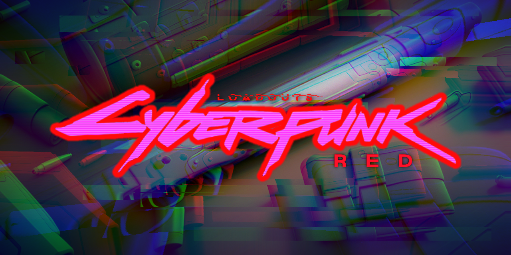

# foundry-vtt-loadouts-cpr

## Loadouts for Cyberpunk Red
As-written the world of Cyberpunk Red (CPR) puts a lot of emphasis of fashion, culture, and in-grouping. The world should tailor its responses to the preparations that the characters have made beforehand; a man carrying a bazooka and dressed like a Bag Lady is unlike to be invited into the local crime lord's inner sanctum.

On a tabletop - especially a virtual one - how 'strapped' a player character is can be hard to track, and their fashion even more so.

While I built [Foundry-VTT Loadouts](https://github.com/Draphtx/foundry-vtt-loadouts) the goal was initially to support Cyberpunk specifically, giving myself as a GM a way to see, at a glance, how the players were dressed and what they were carrying. 

I also relished the idea of making them manage their inventory more effectively. By choosing the sizes and shapes of the items they were carrying, I could make very explicit rules for ideas that, in Cyberpunk Red's source materials, are left to 'common sense.'

## Extended Loadouts Functionality
With additional CPR-specific content on the way, this module currently provides the following benefits for Cyberpunk Red players:

`Magazine Support` Use the token's health bar to represent current magazine state

`Equipped State Support` Allow for all Cyberpunk Red item carry options (owned, carried, equipped) to be reflected in Loadouts tiles and tokens.

`Loadouts: CPR Weapons Compendium` with existing, pre-configured items for use in your Loadouts-enabled games.
